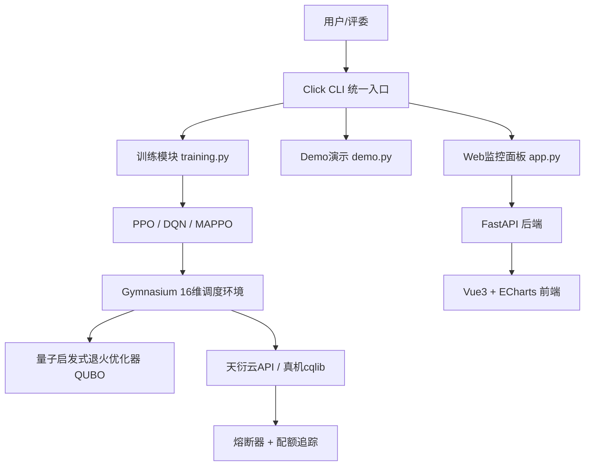

# 量子RL驱动的天衍云平台智能调度系统

> 2026年度"揭榜挂帅"擂台赛参赛项目
> 选题编号：XA-202609 | 发榜单位：中国电信集团有限公司
> Version: 9.1.0

[](https://github.com/xiabai2008/quantum-rl-scheduler/actions/workflows/ci.yml)
[](https://www.python.org/)
[](LICENSE)

## 项目简介

本项目面向"量子+AI双向赋能"核心命题，构建基于强化学习（RL）的天衍云平台智能调度系统。

**双向赋能机制：**

| 方向 | 层级 | 核心成果 |
|:--|:--|:--|
| **AI赋能调度层** | PPO Agent 实时最优分流 | **+20.24%**（vs 真实 FCFS 量子路由基线，N=250，Welch t p=7.56e-12，95%CI [+14.3%,+26.7%]，8.5 基线诚实化；旧 +123.4% 为 vs Hybrid-Default 弱基线，已废弃） |
| **量子赋能AI** | 真机噪声反馈优化鲁棒性 | N=25 Wilcoxon signed-rank p=2.98e-08，Cohen's d_z=7.7089，噪声致奖励下降12.43%（事后功效1.0，Bonferroni显著，统计成立证据链，Issue #532） |

**最新硬核突破（v9.1）：**
- **公平性感知调度**：Jain公平性指数观测(可选第17维) + 租户等待时间偏差惩罚(#587/#588)
- **观测维度消融配置**：支持observation_dim参数截断观测空间，用于D2消融实验(#585)
- **编译环境可配置规模**：支持自定义物理比特数和耦合图，天衍-287预设10x11网格拓扑(#594/#616)
- **16维观测空间**：新增串扰风险和任务到达率滑动平均，覆盖从基础资源到物理噪声到并发时序的完整特征集
- **4×4 2D网格耦合图**：匹配天衍-287真机nearest-neighbor拓扑，SWAP门减少62%（vs 线性链）
- **Dynamic QEM**：在执行时间与保真度之间智能权衡。
- **串扰感知空间并发 (Crosstalk-Aware)**：在多任务并发时主动规避拓扑串扰。
- **标准PPO-MLP交付模型**：100K步训练收敛至最优策略，兼容`PPO.load()`一键加载，MLP=LSTM性能等价但训练快5倍

**量化目标：** 综合调度收益+20.2%（核心目标，已达成）；资源利用率-3.3%（N=250 真实 FCFS 基线下，R-P-01 ≥30% 目标未达成，8.5 审查诚实化）

## 项目状态（v9.1）

| 指标 | 数值 |
|------|------|
| 核心代码量 | 约 1.2 万行 Python（src/ 68 文件） |
| 测试文件 | 94+ 个文件，3696 测试用例 + 21 benchmark = 3717（pytest --collect-only 实测，2026-08-05） |
| CI 强制覆盖率 | 80%（CI 实测通过，pyproject.toml `fail_under=80`；历史值 93.58% 随测试集扩充已变化，以 CI 报告为准） |
| 观测空间维度 | **16维**（新增串扰风险、任务到达率MA） |
| 动作空间 | **4维**（新增 QUANTUM_QEM 误差缓释动作） |
| PPO-LSTM 训练 | 支持 `RecurrentPPO` 时序记忆（消融实验用），交付模型为标准PPO-MLP |
| 真机可用性验证 | 天衍-287 30/30任务成功（N=10 seeds×3策略，100%成功率） |
| PPO vs FCFS（仿真） | 综合奖励提升 20.2%（16维权威实验N=250，Welch t 检验 p=7.56e-12，Cohen's d=-2.1353） |
| PPO vs FCFS（真机参与率） | +353%（N=10, PPO=1736 vs FCFS=383；注：混合评估环境，性能提升主要由仿真驱动，权威仿真结论为+20.2%） |
| 多机器 MAPPO | 奖励 4,294（vs 单机 2,305，提升 +86.3%） |
| 公平性调度 | Jain Fairness Index观测 + 等待时间偏差惩罚（#587/#588） |
| 电路编译 AI | PPO编译Agent（探索性验证），公平对比v2（4×4 2D网格，同池配对60电路，Issue #451）；深电路N=80扩充实验（Issue #559）：SWAP减少+38.5%（Wilcoxon p=2.75e-02显著，t检验p=2.49e-03，seed=7交叉验证+43.4%）；全60电路p=8.40e-01不显著、浅/中电路无优势（诚实披露）；原76.4%为不公平对比已废弃 |
| 编译环境可配置 | 支持天衍-287(10x11网格)等多种拓扑（#594/#616） |
| VQE 行业场景 | 10分子×100任务，PPO +97.5% vs FCFS |
| OR-Tools 对比 | 20/50/100任务，OR-Tools静态最优，PPO动态优势 |
| 消融实验 | 六维度全量完成（D1-D5+架构消融MLP/LSTM），MLP=LSTM收敛等价 |
| 压力测试 | 4 种极限场景 PPO 综合稳定性最佳 |
| 工程韧性 | 熔断器 + 8类异常体系 + Prometheus 可观测性 |
| 代码质量 | ruff(10类规则) + mypy(8项收紧) + bandit 安全扫描 |
| 比赛材料 | PPT 17页 + 白皮书PDF（7章） + 视频分镜脚本 6段 |

## 项目架构



```
quantum-rl-scheduler/
├── src/                      # 源代码（68 文件）
│   ├── exceptions.py         # 统一异常体系（8 类）
│   ├── scheduler/            # RL调度引擎（env + agent + parser + marl + multi_objective_env）
│   ├── api/                  # 天衍云API封装（Mock/真实/cqlib 三模式 + 熔断器）
│   ├── quantum/              # 量子启发式退火加速模块（QUBO + 异步闭环）
│   ├── visualization/        # FastAPI + Vue3 + Echarts 监控面板
│   └── utils/                # 工具函数 + Prometheus 指标
├── tests/                    # 94+ 个测试文件，3696 用例 + 21 benchmark = 3717
├── tests/                    # 94+ 个测试文件，3696 用例 + 21 benchmark = 3717
│   └── benchmarks/           # 性能基准测试
├── scripts/                  # 按功能分区（training/evaluation/demo/testing/benchmarking/reporting）
│   └── cli.py                # Click 统一命令行入口
├── docs/                     # 团队文档（上手指南、Git规范、分工、协同开发）
├── config/                   # 系统配置（config.yaml + .env.example）
├── results/reports/          # 实验数据固化报告（61份）
├── .github/workflows/        # CI/CD 4 Job 流水线 + PR 自动化
├── .devcontainer/            # VS Code 开发容器
├── pyproject.toml            # 统一配置（ruff/mypy/bandit/pytest/coverage）
├── mypy.ini                  # 类型检查（8项严格配置）
├── .pre-commit-config.yaml   # Git commit 自动检查
└── Dockerfile + compose      # 一键 Docker 部署
```

## 快速开始

### 方式一：Demo 一键启动（评委/演示推荐）

安装依赖后，一条命令启动完整 Demo（自动检测依赖、启动服务、打开浏览器）：

```bash
python scripts/demo_one_click.py
```

脚本会自动：
- 检查 Python 版本和必需依赖（缺失时自动安装）
- 检查 PPO 模型文件
- 寻找可用端口（默认 8000）
- 启动 uvicorn 服务器
- 等待服务就绪后自动打开浏览器
- 打印访问地址和操作指引

### 方式二：一键初始化（开发）

```bash
git clone https://github.com/xiabai2008/quantum-rl-scheduler.git
cd quantum-rl-scheduler

# Linux / macOS / Git Bash
bash setup.sh

# Windows PowerShell
powershell .\setup.ps1
```

### 方式三：手动安装

```bash
git clone https://github.com/xiabai2008/quantum-rl-scheduler.git
cd quantum-rl-scheduler

python -m venv .venv
source .venv/Scripts/activate   # Windows
# source .venv/bin/activate     # macOS/Linux

pip install -r requirements.txt
pip install -e .                # 将 src/ 注册为可导入包，任意目录运行脚本不报 No module named 'src'
cp .env.example .env            # Mock 模式默认开启
```

> **可复现性提示（Issue #383）**：`requirements.txt` 已为核心依赖添加主版本上限约束，避免大版本变化破坏实验复现性。如需完全可复现的环境，可在干净虚拟环境中执行：
> ```bash
> pip install -r requirements.txt
> pip freeze > requirements.lock
> # 后续使用 pip install -r requirements.lock 安装完全一致的版本
> ```

### 方式四：VS Code Dev Container

安装 [Dev Containers](https://marketplace.visualstudio.com/items?itemName=ms-vscode-remote.remote-containers) 扩展后，打开项目文件夹，点击右下角 "Reopen in Container"。

### 方式五：Docker 一键复现（Docker）

```bash
# 一条命令，5 分钟看到对比结果（容器已做安全加固：#886 read_only + cap_drop）
docker compose up

# 容器内运行仿真/公平性演示（logs/models/results 通过卷持久化）
docker compose exec web python scripts/evaluation/run_simulation.py --episodes 2
docker compose exec web python scripts/evaluation/run_fairness_demo.py --episodes 5
```

### 验证环境

> 所有脚本默认在**仓库根目录**运行。脚本已内置项目根 sys.path 引导；若仍遇到 `No module named 'src'`，执行 `pip install -e .` 或设置 `PYTHONPATH` 为仓库根即可。

```bash
# CLI 统一入口
python scripts/cli.py --help

# 快速训练（5000步验证）
python scripts/cli.py train --timesteps 5000

# 8种策略对比仿真（默认加载deliverable_models/ppo_best_model_16dim.zip）
python scripts/cli.py simulate --num-tasks 200

# 公平调度演示（多租户公平性度量：Jain 指数/max-min 比率，输出 results/fairness_demo_result.json）
python scripts/evaluation/run_fairness_demo.py --episodes 5 --steps 200

# 启动 Web 监控界面
python scripts/cli.py serve --port 8000

# 运行全部测试
pytest tests/ --cov=src
```

## Mock 模式（开发阶段默认）

无需真实天衍云平台权限即可完整开发。Mock 客户端模拟：
- 量子任务提交（返回虚拟 task_id）
- 任务状态自动轮转（PENDING → RUNNING → COMPLETED）
- 量子测量结果（随机计数）
- 可配置网络延迟和失败率

切换到真实 API：
```bash
# 修改 .env
TIANYAN_MOCK_MODE=false
TIANYAN_API_KEY=你的真实API密钥
```

## 队友须知

> 认领 Issue 前先读这段，避免走弯路、避免浪费共享真机机时。

### 1. 默认纯本地开发，无需真机
项目默认 `TIANYAN_MOCK_MODE=true`（见 `.env.example`），**绝大多数开发、测试、仿真都在本地 Mock 模式下完成**，不需要天衍云权限。只有极少数任务在"真机验证环节"才需连接真实硬件。

### 2. 当前开放 Issue 的真机适用范围

> **Issue 状态请直接查看 [GitHub Issues 页面](https://github.com/xiabai2008/quantum-rl-scheduler/issues)**，避免文档与仓库实际状态不同步。
>
> 历史上曾列出 #142-#152 等开放 Issue，已于 2026-07-26 全部关闭。新增 Issue 的真机适用范围请参考 Issue 标签与描述。

**真机使用原则**（适用于所有 Issue）：
- 默认纯本地仿真开发（`TIANYAN_MOCK_MODE=true`）
- 真机仅用于"全量/分层 QUBO 上硬件验证"或"真机集成测试"的可选环节
- 真机客户端封装类（`tianyan_cqlib.py`、`env_real_machine.py`）的测试可用 Mock 模拟响应，无需真机
- 退火模块（`annealing.py`）默认 `simulation_mode=True`，使用本地 D-Wave neal 求解器

### 3. 真机机时珍贵，省着用
- 免费机时包仅 1-qubit 电路稳定（默认只用单比特门）。
- 真机只留给 **退火验证 / 真机集成测试 / 客户端封装验证** 等可选环节；开发期一律用 Mock。
- 连续失败 3 次会自动降级 Mock（正常现象，非 bug）。

### 4. 需要连真机时
读 [`docs/真机训练接入指南.md`](docs/真机训练接入指南.md)：装 `requirements-quantum.txt` → 配 `.env`（API Key 向瑞哥领取）→ `CqlibTianyanClient.authenticate()` 验证连接 → `python scripts/training/train_agent_real.py --timesteps 5000 --real-prob 0.05`。
**API Key 不外泄、`.env` 不入库。**

## 技术栈

| 层级 | 技术 | 用途 |
|------|------|------|
| 语言 | Python 3.10+ | 全部开发 |
| RL框架 | Stable-Baselines3 | PPO + DQN + MAPPO |
| RL环境 | Gymnasium | 标准化调度环境 |
| 深度学习 | PyTorch 2.0+ | 神经网络 |
| 量子仿真 | Qiskit / PennyLane | 量子电路仿真 |
| 量子真机 | 天衍云 cqlib SDK | 105数据比特+182耦合比特超导处理器 |
| 量子启发式退火 | D-Wave dimod / neal | QUBO求解 |
| Web后端 | FastAPI + Uvicorn | 监控API |
| Web前端 | Vue3 + Echarts | 监控面板 |
| CLI | Click | 统一命令行入口 |

## 团队基础设施

| 工具 | 用途 |
|------|------|
| `pyproject.toml` | Black + ruff + bandit + mypy + pytest + coverage + mutmut 统一配置 |
| `mypy.ini` | 8项严格类型检查（仅2模块暂时豁免：annealing/scripts） |
| `.pre-commit-config.yaml` | Git commit 前自动格式检查 + Commit 格式校验 |
| GitHub Actions CI | lint(ruff+bandit) + test(3.10/3.11/3.12矩阵) + typecheck(mypy) + benchmarks + QUBO形式化验证 + 覆盖率artifact |
| Dependabot | pip + GitHub Actions 自动依赖更新 |
| VS Code Dev Container | 一键开发环境（Docker + 12+ 扩展） |
| `setup.sh` / `setup.ps1` | 跨平台一键环境初始化 |

> **CI 覆盖率 artifact（Issue #260）**：每次 CI 运行都会生成 `coverage.xml`，
> 并作为名为 `coverage-xml` 的 artifact 上传，可在 Actions 页面下载查看本次构建的覆盖率快照；
> 在 PR 中还会由 `ci(#253,#260)` 自动发布一条覆盖率评论（当前展示本次构建的总行覆盖率）。
> **本地复现覆盖率**：`pytest --cov=src --cov-report=xml:coverage.xml --cov-report=term-missing`，
> 生成的 `coverage.xml` 与 CI 同格式，可用 `coverage report` 查看明细或 `coverage html` 生成可视化报告。
> **QUBO 形式化验证（Issue #253）**：CI 会运行 `tests/test_qubo_optimization.py` 中
> `-k "formal or property"` 选中的 QUBO 形式化/属性测试（基于 numpy 随机种子的属性测试），
> 验证 QUBO 矩阵对称性、能量公式正确性等数学性质。

## 工程韧性

| 组件 | 功能 |
|------|------|
| `src/exceptions.py` | 8类统一异常（code + retryable 语义） |
| `src/api/circuit_breaker.py` | 熔断器（CLOSED/OPEN/HALF_OPEN 三态） |
| `src/utils/metrics.py` | 7个 Prometheus 指标（Gauge/Counter/Histogram） |
| `scripts/cli.py` | Click 统一入口（train/simulate/serve/demo） |

## 核心功能

| 模块 | 功能 | 状态 |
|------|------|------|
| 任务解析器 | 解析QASM量子任务，资源预估 | 已验证 |
| RL智能体 | PPO（主力）+ DQN（备选）+ MAPPO（多智能体） | 已验证 |
| 调度环境 | 16维状态空间 / 4类动作 / 异质化任务 | 已验证 |
| 天衍API | Mock / REST / cqlib 三模式 + 多机器协调器 | 已验证 |
| 量子启发式退火 | QUBO映射 + 退火求解 + 异步闭环 | 已验证 |
| 多机器调度 | 3台机器MAPPO协同，奖励+86.3%（仿真验证） | 已验证 |
| 真机可用性验证 | 315次SDK调用100%成功，全链路验证 | 已完成 |
| Web可视化 | FastAPI + Vue3 + Echarts + WebSocket | 已验证 |
| 可观测性 | Prometheus /metrics 端点 | 已验证 |
| CI/CD | 4 Job流水线 + Codecov + Dependabot | 已配置 |
| Docker部署 | 一键容器化部署 | 已配置 |

## 实验成果

| 实验 | 核心结论 |
|------|---------|
| 8策略对比 | PPO奖励1982.69 vs FCFS 1648.91，+20.2%（16维权威N=250，Welch t 检验 p=7.56e-12，Cohen's d=-2.1353） |
| 真机验证 | N=10 seeds, PPO=1736 vs FCFS=383 (+353%真机参与率验证；注：混合环境，权威性能结论为仿真+20.2%)，30/30成功 |
| 六维消融 | D1算法+20.2% > D4多机+86.3% > D5退火+6.4%(不显著) > D2状态+2.1%；MLP=LSTM收敛等价 |
| 电路编译（探索性） | 公平对比v2(4×4 2D网格, 60电路同池配对, Issue #451)：深电路(14-16q, 20电路)SWAP减少+33.3%（方向性优势，样本量不足），全60电路p=8.40e-01不显著，中+深40电路子集p=5.99e-01不显著；2D网格vs线性链拓扑消融SWAP-62% |
| VQE行业 | 10分子×100任务, PPO +97.5% vs FCFS |
| OR-Tools | CP-SAT静态最优, PPO动态实时优势 |
| 压力测试 | 4场景PPO综合稳定性最强；量子波动场景PPO +91.4% |
| 多租户公平调度 | 5租户Jain's公平指数=0.9875，PPO总奖励+57.6% vs FCFS |
| D3奖励消融 | 7权重预设×2策略×10seeds，揭示策略-奖励耦合关系 |
| MLP vs LSTM | PPO-MLP、PPO-LSTM、PPO-LSTM+Annealing收敛到同一策略(83%量子/17%混合)，MLP训练快5倍 |

详见 `results/reports/` 目录。

## 比赛材料

> 以下材料位于仓库上级目录（比赛提交材料，非代码仓库的一部分）：

| 材料 | 文件 | 状态 |
|------|------|------|
| 技术白皮书 | `docs/technical_whitepaper.pdf` | ✅ 已完成（7章，2026-07-27） |
| 答辩PPT | — | 🔄 制作中（大纲：`答辩PPT大纲.md`） |
| 演示视频分镜脚本 | `演示视频分镜脚本.md` | ✅ 已完成 |
| 演示视频（5分钟） | — | 🔄 待录制 |
| 答辩PPT大纲 | `答辩PPT大纲.md` | ✅ 已完成 |
| 实验数据报告 | `results/reports/` 下 63 份报告 | ✅ 已完成 |

## 最终提交包说明

比赛最终提交物清单定义在 `config/submission_manifest.yaml`，使用校验工具管理：

```bash
# 准备提交物（创建 dist/ 目录 + 生成缺失项报告 + 输出检查清单）
python scripts/ci/validate_submission.py --prepare

# 校验所有提交物是否符合要求
python scripts/ci/validate_submission.py --check

# 生成缺失项清单报告
python scripts/ci/validate_submission.py --check --report results/reports/submission_validation_report.md

# 打包（校验通过后生成 dist/submission_v9.1_YYYYMMDD.zip）
python scripts/ci/validate_submission.py --pack
```

### 提交物清单（13 项）

| 编号 | 名称 | 类型 | 状态 |
|:--:|:--|:--:|:--:|
| CODE_REPO | 代码仓库（Git 标签 v9.1-submission） | git_tag | tag 已存在（临时版）；8/15 冻结时更新指向验收 HEAD |
| CODE_ARCHIVE | 代码压缩包 | zip | 冻结后 --pack 生成 |
| WHITEPAPER | 技术白皮书（20-50页 PDF） | pdf | docx→PDF 转换 |
| PRESENTATION | 答辩 PPT（15-20页，deliverable_models/答辩PPT.pptx） | pptx | ✅ 初版已生成 |
| DEMO_VIDEO | 演示视频（4-5分钟 1080p） | mp4 | 人工录制 |
| EXP_STRATEGY | 策略对比报告 | md | ✅ 已完成 |
| EXP_ABLATION | 消融实验报告 | md | ✅ 已完成 |
| EXP_STRESS | 压力测试报告 | md | ✅ 已完成 |
| EXP_REAL | 真机验证报告 | md | ✅ 已完成 |
| EXP_STAT | 统计显著性报告 | md | ✅ 已完成 |
| MODEL_PPO | PPO 权威模型（16维调度层） | zip | ✅ 已完成 |
| MODEL_PPO_COMPILATION | 编译层 PPO 模型（14维） | zip | ✅ 已完成 |
| REQUIREMENTS_MATRIX | 需求追溯矩阵 | md | ✅ 已完成 |

> 注：v9 已删除 DQN 模型（不再作为提交物），清单以 `config/submission_manifest.yaml` 为准。

### 代码冻结流程（8/15）

1. 确认所有 CI 检查全绿
2. 运行 `python scripts/ci/pre_freeze_check.sh` 执行冻结前检查
3. 运行 `python scripts/ci/validate_submission.py --check` 确认通过
4. 更新标签：`git tag -f -a v9.1-submission -m "v9.1 提交版本（冻结最终版）" && git push origin v9.1-submission --force`
5. 打包：`python scripts/ci/validate_submission.py --pack`
6. 提交压缩包至比赛平台

## 开发计划

| 里程碑 | 截止日期 | 内容 |
|--------|----------|------|
| Track A 工程收尾 | 7/1 已完成 | pre-commit + scripts/ 重组 |
| Track B 比赛材料 | 7/1 已完成 | PPT + 白皮书 + 视频脚本 + 实验数据 |
| Track C 质量深化 | 7-8月 | mypy豁免清理 + 覆盖率80% + mutation testing |
| PPO 真机闭环 | 7-8月 | cqlib 注入调度循环 |
| M5 参赛提交 | 9/15 | 最终材料提交 |

## 文档索引

### ⭐ 核心交付物

| 文档 | 说明 |
|------|------|
| [**技术白皮书PDF**](docs/technical_whitepaper.pdf) | **评审交付物**（7章完整内容，408KB） |
| [技术白皮书源文件](docs/technical_whitepaper.md) | Markdown源文件（修改后需重新生成PDF） |
| [多场景压力测试报告](results/reports/multiscenario_benchmark.md) | 5场景×6策略压力测试+场景-算法决策树 |
| [Demo演示脚本](docs/demo_script.md) | 3分钟演示脚本+旁白 |

### 开发与文档

| 文档 | 说明 |
|------|------|
| [文档目录索引](docs/README.md) | 完整文档导航（38份文档分类索引） |
| [新人上手指南](docs/新人上手指南.md) | 详细 onboarding（11步 + FAQ） |
| [队友协同开发指南](docs/队友协同开发指南.md) | 精简版快速上手（15分钟） |
| [真机训练接入指南](docs/真机训练接入指南.md) | 连接天衍云真机并进入训练（装 cqlib → 配 .env → 验证连接 → 跑训练） |
| [Git工作流](docs/Git工作流.md) | 分支策略 + Commit规范 + PR流程 |
| [团队分工](docs/团队分工.md) | 10人角色职责分配 |
| [CONTRIBUTING.md](CONTRIBUTING.md) | 贡献指南 + 代码规范 |
| [AGENTS.md](AGENTS.md) | AI Agent 通用项目记忆 |
| [技术瓶颈分析](docs/technical_bottlenecks.md) | 7项技术瓶颈 + 缓解策略 |
| [退火显著性答辩策略](docs/annealing_significance-defense.md) | p=0.19应对话术 + 5类评委问题 |
| [答辩Q&A手册](docs/defense_qa_handbook.md) | 30+预设问题及标准答案 |
| [部署架构](docs/deployment.md) | 三阶段部署路径（原型→试点→生产） |
| [跨硬件兼容性](docs/cross_hardware.md) | 三层解耦架构 + 扩展路径 |
| [价值量化报告](docs/value_quantification.md) | 10项指标 + ROI分析 + 市场数据来源（内部详细参考） |
| [公平调度报告](results/reports/fair_scheduling_report.md) | 5租户Jain's指数=0.9875 |
| [D3奖励消融报告](results/reports/d3_reward_ablation_report.md) | 7预设×2策略×10seeds消融 |

> **PDF生成命令**：修改白皮书后运行 `python scripts/generate_whitepaper_pdf.py` 重新生成PDF

## 许可证

MIT License © 2026 胡展瑞

---

[^annealing-sim]: 当前版本使用经典模拟退火（neal库）求解QUBO问题，真机量子退火为后续工作。详见 [技术瓶颈分析](docs/technical_bottlenecks.md) 瓶颈1。
