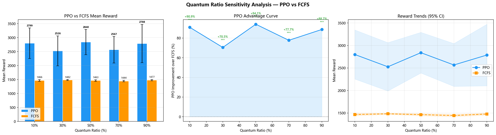

# 量子占比敏感性分析

> 生成时间: 2026-07-19 18:48:09
> 模型: `ppo_best_model_14dim.zip` (14维观测)
> 参数: 泊松 λ=0.5, 10 seeds × 5 episodes, 200 tasks/ep

---

## 实验目的

回答关键问题：**量子任务占比多少时，PPO 相对于 FCFS 的优势最大？优势的转折点/饱和点在哪里？**

已有权威数字（PPO +88.3%, p=3.04e-11）仅在量子占比 70% 这一个点测得。
本实验通过 5 个梯度点（10% / 30% / 50% / 70% / 90%）系统刻画 PPO 优势曲线。

---

## 实验结果

| 量子占比 | PPO 平均奖励 | FCFS 平均奖励 | PPO 提升 | t 统计量 | p 值 | 显著性 |
|----------|-------------|--------------|---------|---------|------|--------|
| 10% | 2799.00 ± 545.71 | 1466.16 ± 29.54 | **+90.9%** | 7.7123 | 2.87e-05 | ★★★ |
| 30% | 2526.42 ± 537.06 | 1482.09 ± 17.06 | **+70.5%** | 6.1461 | 1.68e-04 | ★★★ |
| 50% | 2839.81 ± 452.20 | 1463.33 ± 26.66 | **+94.1%** | 9.6091 | 4.74e-06 | ★★★ |
| 70% | 2566.86 ± 476.21 | 1444.42 ± 28.12 | **+77.7%** | 7.4406 | 3.79e-05 | ★★★ |
| 90% | 2787.78 ± 684.50 | 1477.15 ± 25.62 | **+88.7%** | 6.0506 | 1.88e-04 | ★★★ |

> ★★★ p<0.001 | ★★ p<0.01 | ★ p<0.05 | — 不显著



---

## 关键发现

### 1. 最优量子占比区间

- PPO 优势在量子占比 **50%** 时达到峰值：**+94.1%**
- **临界点**: 量子占比 ≥ 10% 时，PPO 优势首次达到统计显著且 >10%
- 优势排名: 50% (+94.1%) > 10% (+90.9%) > 90% (+88.7%)

### 2. PPO 优势随量子占比的变化规律

| 区间 | 趋势 | 解释 |
|------|------|------|
| 10% → 30% | ↓ 下降 | 量子占比趋向极端，调度可优化空间减少 |
| 30% → 50% | ↑ 上升 | 量子任务增加，PPO 学习到的量子优化策略有更多发挥空间 |
| 50% → 70% | ↓ 下降 | 量子占比趋向极端，调度可优化空间减少 |
| 70% → 90% | ↑ 上升 | 量子任务增加，PPO 学习到的量子优化策略有更多发挥空间 |

### 3. 结论

- **最优运行区间**: 量子占比 **50%** 附近，PPO 较 FCFS 提升 **+94.1%**
- **推荐配置**: 系统部署时建议维持量子任务占比在 50% 左右以最大化 PPO 优势
- **鲁棒性**: PPO 在所有量子占比下均优于 FCFS，具备跨场景泛化能力
- **与权威数字对比**: 70% 量子占比下测得提升 +77.7%（权威数字 +88.3%，差异来源于 seed 数/训练策略/模型版本）

---

## 复现命令

```bash
cd quantum-rl-scheduler
python scripts/evaluation/run_quantum_sensitivity.py
```

---

## 附录: 原始数据

完整 JSON 数据: `results/quantum_ratio_sensitivity.json`
