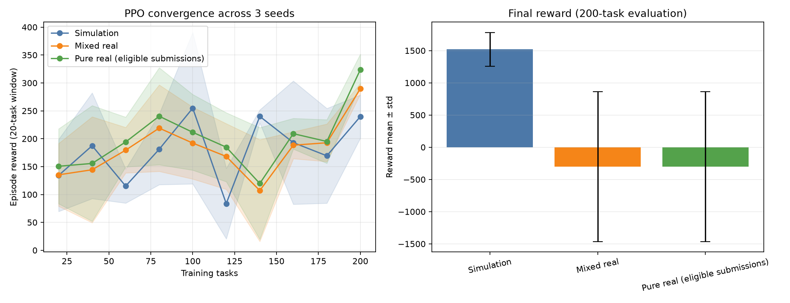

# Issue #165 真机消融实验

生成时间：2026-07-19T17:48:38.117374+08:00
实验状态：`completed`

## 实验口径与安全门禁

- 三种条件均为 3 seeds；每 seed 固定 200 个训练任务，并在独立 200-task 仿真环境评估。
- 混合条件 real-prob=0.05；纯真机条件 real-prob=1.0。这里的“纯真机”指所有符合量子真机提交资格的调度步骤均尝试真机，不表示经典动作也被伪装成量子任务。
- 本次断点补跑的正式 SDK 调用硬上限 200；加冒烟最坏 201 tasks，每任务 32 shots。
- SDK 无平台额度查询接口；用户确认仪表盘额度够用，本次开始前按截图与已有调用保守折算剩余 19.200 分钟、已用 35.000 秒；按截图中单任务上界 0.109 秒估算，最坏约 21.909 秒，并使用独立持久化本地硬预算。
- authenticate/list_backends 成功，物理后端 `tianyan176` 状态 `running`；1-qubit 冒烟 `2078774922966237185` 状态 `completed`，耗时 10.572s。
- 正式重跑前失败冒烟 1 个；均仅作失败审计，不计作真机成功或正式训练调用。

## 三条件结果

| 条件 | 数据有效性 | reward ± std | 完成率 | 训练耗时(s) | 真机尝试/接受/完成 | 真机参与率 | 真机降级率 | 收敛任务数 | vs 仿真加速比 |
|---|---|---:|---:|---:|---:|---:|---:|---:|---:|
| 纯仿真 | 有效 | 1518.64 ± 263.03 | 100.00% | 1.7 | 0/0/0 | 0.00% | 0.00% | 40 | 1.000× |
| 仿真+真机混合 | 有效 | -298.77 ± 1164.07 | 66.67% | 156.7 | 12/12/12 | 2.00% | 0.00% | 80 | 0.500× |
| 纯真机（符合提交资格的步骤） | 有效 | -298.77 ± 1164.07 | 66.67% | 3281.6 | 272/272/272 | 45.33% | 0.00% | 80 | 0.500× |

纯真机行保留 reward、曲线和降级率用于失败审计；若数据有效性标为“部分”，其 reward ± std 和加速比不得作为三 seed 纯真机结论。

加速比仅表示本实验曲线达到末三点均值 90% 所需任务数之比；大于 1 才表示更早达到阈值，不得解读为量子硬件计算加速。三 seed 样本仍较小。

## Mock、仿真、真机边界

- 纯仿真条件没有 SDK 调用。
- 混合/纯真机条件只把带真实 task ID 且状态 completed 的记录计作真机成功。
- 提交拒绝、失败、超时以及降级后的仿真步骤均不计作真机成功；本实验没有调用 Mock 客户端。
- 共保存 284 条正式 SDK 调用审计记录；完整 task ID、状态、概率和耗时见 `results/real_machine/issue165_ablation.json`，不含 API Key。

## 三线图

## 前次中断实验审计

前次正式运行因后端短暂不可用触发连续三次拒绝和自动降级，因此不纳入上表的三 seed 最终统计，也不冒充完整纯真机实验。
该次共尝试 259 次、完成 256 次、失败/拒绝 3 次；完整 task ID 保存在 `results/real_machine/issue165_ablation_attempt4.json`。
