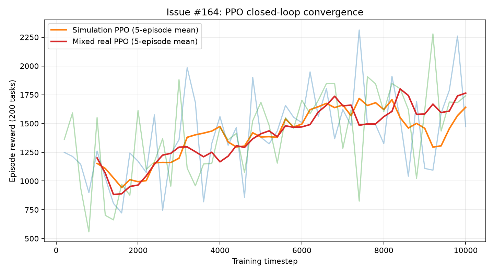

# Issue #164 真机闭环训练报告

生成时间：2026-07-18T00:38:19.444809+08:00

## 实验口径

- PPO 训练步数：10,000；episode 固定 200 个调度步骤。
- 混合条件真机抽样概率：4.00%；硬上限：8 次 SDK 提交调用。
- 真机电路：1-qubit QCIS；每任务 32 shots。
- 最终模型统一在纯仿真环境评估 5 episodes × 200 tasks，避免评估阶段额外消耗额度。
- Mock、仿真和真实真机严格分开；本实验未把失败或降级计作真机成功。

## 正式运行前检查

- dotenv 加载、authenticate：成功；后端 `tianyan176` 状态：`running`。
- cqlib 未暴露平台权威余额接口；额度检查采用仓库 QuotaTracker 本地账本，并已在 Issue #164 @xiabai2008 说明。
- 最小冒烟：真实真机任务 `2078156758599368706`，1 qubit / 32 shots，状态 `completed`，耗时 7.727s。

## 结果

| 条件 | 模式 | 训练耗时(s) | 最终 reward | 完成率 | 真机接受/完成/失败 | 参与率(每200任务口径) | 降级 |
|---|---|---:|---:|---:|---:|---:|---|
| 纯仿真 PPO | Simulation | 19.082 | 1463.55 ± 59.64 | 100.00% | 0/0/0 | 0.00% | 否 |
| 仿真+真机 PPO | Simulation + real hardware | 115.298 | 2489.06 ± 1910.63 | 100.00% | 8/8/0 | 4.00% | 否 |

最终 reward 差值（混合 - 仿真）：+1025.51。
收敛 timestep（末五集均值 90% 阈值）：仿真 5600，混合 6400；收敛加速比 0.875×。

`0.875× < 1` 表示本次混合条件没有获得收敛步数加速。混合训练墙钟时间为
115.298s，约为纯仿真 19.082s 的 6.04 倍，主要包含真机排队、提交和结果轮询开销。
混合条件最终 reward 更高，但标准差也显著更大；本实验仅使用 1 个训练 seed，不能据此宣称统计显著或量子加速。

## 收敛曲线

## 真机任务审计

| task_id | 状态 | shots | 机器 | 测量概率 | 耗时(s) |
|---|---|---:|---|---|---:|
| 2078156874995470337 | completed | 32 | tianyan176 | `{"0":0.5074246694125297,"1":0.4925753305874702}` | 6.567 |
| 2078156903143444481 | completed | 32 | tianyan176 | `{"0":0.5412963364404942,"1":0.45870366355950576}` | 12.198 |
| 2078156954561445890 | completed | 32 | tianyan176 | `{"0":0.5074246694125297,"1":0.4925753305874702}` | 6.424 |
| 2078156982625533954 | completed | 32 | tianyan176 | `{"0":0.4396813353566008,"1":0.5603186646433991}` | 11.933 |
| 2078157036543283201 | completed | 32 | tianyan176 | `{"0":0.27032300021677863,"1":0.7296769997832213}` | 17.256 |
| 2078157110333702146 | completed | 32 | tianyan176 | `{"0":0.5412963364404942,"1":0.45870366355950576}` | 17.211 |
| 2078157183125819393 | completed | 32 | tianyan176 | `{"0":0.5412963364404942,"1":0.45870366355950576}` | 6.392 |
| 2078157210002919426 | completed | 32 | tianyan176 | `{"0":0.47355300238456527,"1":0.5264469976154347}` | 17.237 |

## 前置尝试审计

这些任务不计入上表正式重跑的 8 次训练提交，但属于本次排障期间真实发生的物理机调用：

| task_id | 状态 | shots | 线路 | 说明 |
|---|---|---:|---|---|
| 2078151135430213633 | completed | 32 | 1q H + M | 用户额度确认后的最小连通性验证 |
| 2078155939812507649 | completed | 32 | 1q H + M | 第一次正式尝试的冒烟任务 |
| 2078156058729385986 | failed | 32 | 1q RY + M | 平台接受后运行失败，未计作成功；随后停止随机参数门并固定稳定线路 |

原始结构化数据见 `results/real_machine/issue164_closed_loop.json`；其中不含 API Key。
