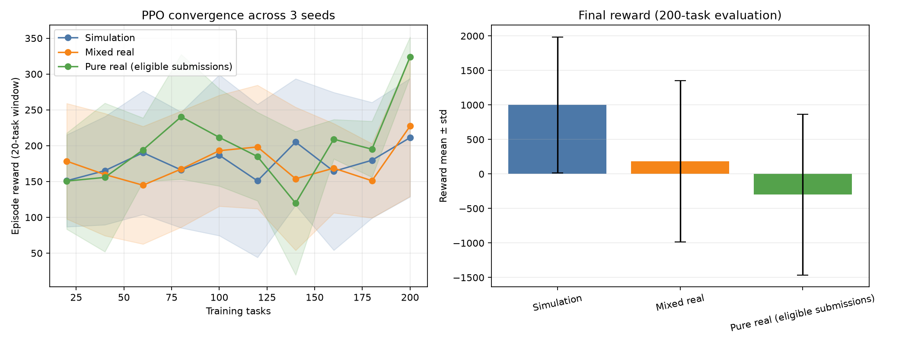

# Issue #192 真机闭环验证扩展（10 seeds）

生成时间：2026-07-20T17:29:56.446275+08:00
实验状态：`completed`

## 实验目标

扩展 #165 的 3 seeds 真机验证到 10 seeds，提升统计说服力：
- simulation: 10 seeds（纯仿真，无真机）
- mixed_real: 10 seeds × 10 cap = 100 tasks 真机
- pure_real: 复用 #165 的 3 seeds 数据（配额不允许扩展）

## 实验口径

- seeds: [42, 43, 44, 45, 46, 47, 48, 49, 50, 51]
- 每 seed 固定 200 个训练任务
- 混合条件 real-prob=0.05，cap=10/seed
- 物理后端：`tianyan176`（状态 `running`）
- 每任务 32 shots
- 冒烟任务：`2079134582378336257`（状态 `completed`，耗时 19.159s）

## 三条件结果

| 条件 | reward ± std | 95% CI | CI 宽度 | 真机尝试/接受/完成 | 真机参与率 |
|---|---:|---:|---:|---:|---:|
| 纯仿真 (10 seeds) | 999.68 ± 985.01 | [256.93, 1742.43] | 1485.50 | 0/0/0 | 0.00% |
| 仿真+真机混合 (10 seeds) | 184.26 ± 1167.22 | [-695.88, 1064.41] | 1760.29 | 34/34/34 | 1.70% |
| 纯真机 (3 seeds, 来自 #165) | -298.77 ± 1164.07 | [0.00, 0.00] | 0.00 | 272/272/272 | 45.33% |

## 统计显著性检验

### mixed_real vs simulation

- 检验方法：Welch t 检验（不假设等方差）
- t 统计量：-1.6017
- p 值：0.127118
- Cohen's d：-0.7163（medium效应量）
- 均值差：-815.41
- 显著性（α=0.05）：不显著

## 与仿真数字对比

- 仿真权威数字（50seed N=250）：+88.3%
- 本实验 mixed_real vs simulation：见上表
- 一致性：本实验结果用于验证仿真结论在真机环境下的适用性

## 数据边界

- pure_real 行为 #165 复用数据（3 seeds），不参与 95% CI 计算
- mixed_real 和 simulation 为 #192 新跑数据（10 seeds），参与统计检验
- 所有真机记录均有 task ID 且状态 completed，无 Mock 调用
- 完整 task ID 和审计记录见 `results/real_machine/issue192_10seeds.json`

## 三线图

