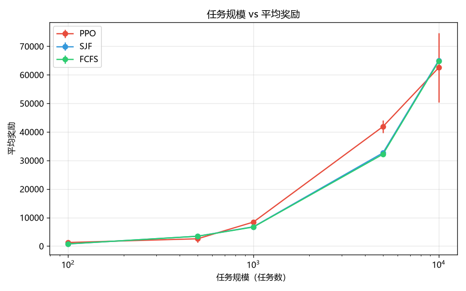
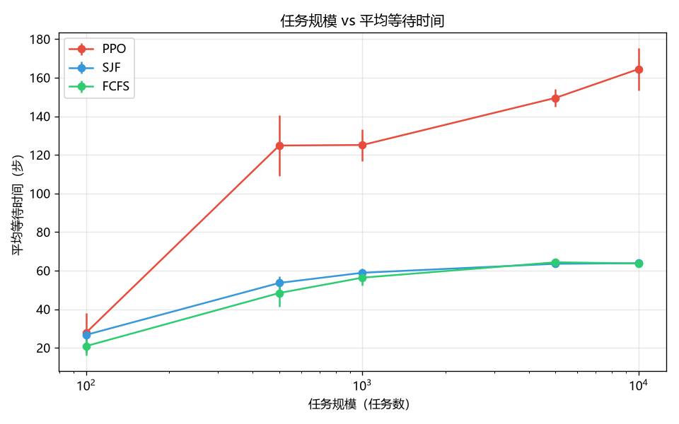
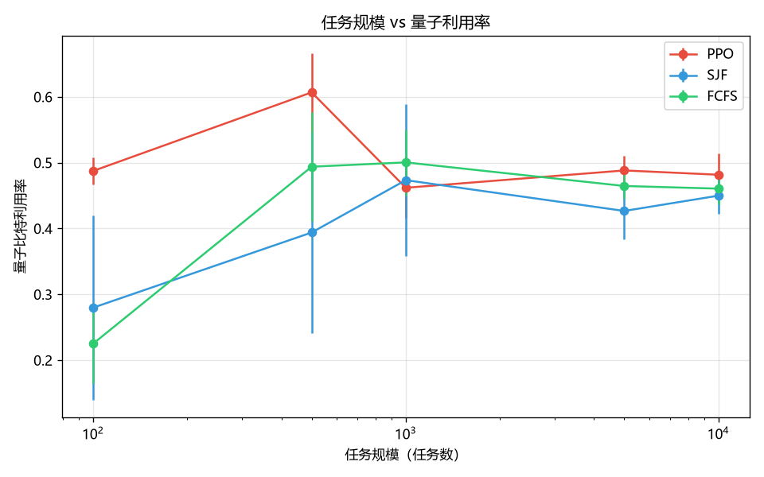
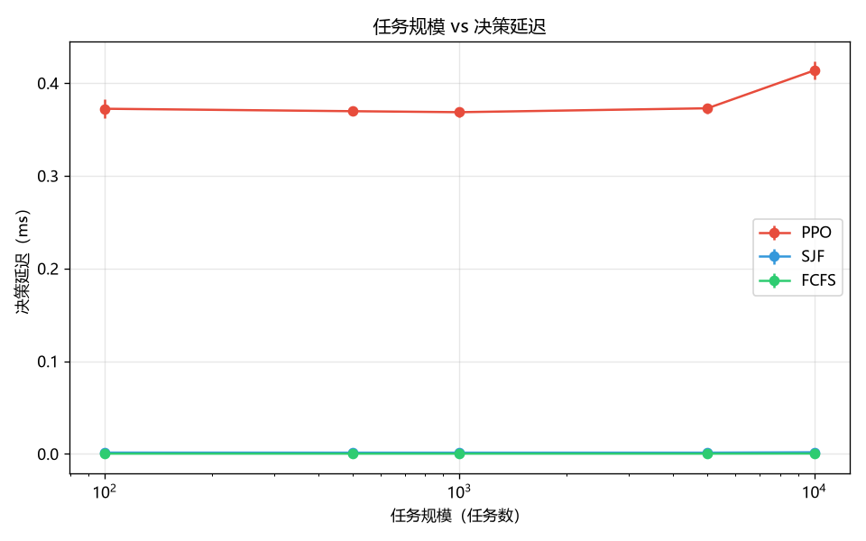

# 任务规模梯度测试报告（Issue #117）

> **测试时间**: 2026-07-26T09:58:51.451334+08:00
> **总运行次数**: 45
> **总耗时**: 96.46s

## 实验配置

- 规模梯度: [100, 500, 1000, 5000, 10000]
- 策略: ['PPO', 'SJF', 'FCFS']
- 每规模 seed 数: 3
- PPO 模型: `deliverable_models/ppo_best_model_14dim.zip`
- 观测维度: 14（原生权威配置）

## 汇总数据

### 平均奖励

| 任务规模 | PPO | SJF | FCFS |
|:--|:--:|:--:|:--:|
| **100** | 1274.43 ± 349.47 | 764.99 ± 24.60 | 789.55 ± 16.57 |
| **500** | 2572.85 ± 1354.59 | 3474.24 ± 94.13 | 3459.70 ± 137.48 |
| **1000** | 8434.68 ± 518.02 | 6777.42 ± 40.67 | 6692.36 ± 138.88 |
| **5000** | 41869.54 ± 2204.63 | 32669.60 ± 415.00 | 32184.37 ± 186.81 |
| **10000** | 62522.48 ± 12187.63 | 65061.30 ± 125.70 | 64739.85 ± 602.30 |

### 平均等待时间

| 任务规模 | PPO 步 | SJF 步 | FCFS 步 |
|:--|:--:|:--:|:--:|
| **100** | 27.923 ± 10.275 | 26.722 ± 0.561 | 20.902 ± 4.906 |
| **500** | 124.859 ± 15.838 | 53.634 ± 3.379 | 48.415 ± 7.043 |
| **1000** | 125.116 ± 8.302 | 58.902 ± 2.027 | 56.356 ± 4.076 |
| **5000** | 149.541 ± 4.562 | 63.551 ± 0.996 | 64.330 ± 1.546 |
| **10000** | 164.478 ± 10.970 | 63.843 ± 0.395 | 63.697 ± 1.596 |

### 量子利用率

| 任务规模 | PPO | SJF | FCFS |
|:--|:--:|:--:|:--:|
| **100** | 0.4874 ± 0.0206 | 0.2798 ± 0.1401 | 0.2251 ± 0.0599 |
| **500** | 0.6068 ± 0.0598 | 0.3940 ± 0.1523 | 0.4939 ± 0.0826 |
| **1000** | 0.4619 ± 0.0460 | 0.4735 ± 0.1155 | 0.5004 ± 0.0500 |
| **5000** | 0.4882 ± 0.0221 | 0.4267 ± 0.0434 | 0.4646 ± 0.0197 |
| **10000** | 0.4817 ± 0.0322 | 0.4499 ± 0.0272 | 0.4606 ± 0.0235 |

### 决策延迟

| 任务规模 | PPO ms | SJF ms | FCFS ms |
|:--|:--:|:--:|:--:|
| **100** | 0.372 ± 0.010 | 0.001 ± 0.000 | 0.000 ± 0.000 |
| **500** | 0.370 ± 0.003 | 0.001 ± 0.000 | 0.000 ± 0.000 |
| **1000** | 0.369 ± 0.006 | 0.001 ± 0.000 | 0.000 ± 0.000 |
| **5000** | 0.373 ± 0.005 | 0.001 ± 0.000 | 0.000 ± 0.000 |
| **10000** | 0.414 ± 0.010 | 0.002 ± 0.000 | 0.000 ± 0.000 |

### 内存占用

| 任务规模 | PPO MB | SJF MB | FCFS MB |
|:--|:--:|:--:|:--:|
| **100** | 0.050 ± 0.003 | 0.044 ± 0.001 | 0.051 ± 0.007 |
| **500** | 0.166 ± 0.002 | 0.175 ± 0.002 | 0.176 ± 0.002 |
| **1000** | 0.326 ± 0.000 | 0.340 ± 0.003 | 0.341 ± 0.003 |
| **5000** | 1.574 ± 0.002 | 1.638 ± 0.005 | 1.641 ± 0.003 |
| **10000** | 3.120 ± 0.009 | 3.274 ± 0.002 | 3.278 ± 0.003 |

## 线性扩展边界分析

**PPO 每任务平均奖励**（reward / n_tasks）:

| 任务规模 | 每任务奖励 | 相对基线变化 |
|:--|:--:|:--:|
| 100 | 12.7443 | +0.00% |
| 500 | 5.1457 | -59.62% |
| 1000 | 8.4347 | -33.82% |
| 5000 | 8.3739 | -34.29% |
| 10000 | 6.2522 | -50.94% |

**线性扩展边界结论**: 在 500 任务规模时每任务奖励下降超过 10%（5.1457 vs 基线 12.7443）

> 注：100 任务规模因 episode 较短，PPO 能完整利用量子窗口，每任务奖励偏高属正常现象。更稳定的参考基线为 1000 任务规模（每任务奖励 8.4347）。

## PPO vs FCFS 逐规模对比

| 任务规模 | PPO 奖励 | FCFS 奖励 | PPO 优势 | PPO 标准差 | FCFS 标准差 | 稳定性对比 |
|:--|:--:|:--:|:--:|:--:|:--:|:--|
| 100 | 1274.43 | 789.55 | +61.41% | 349.47 | 16.57 | FCFS 更稳定 |
| 500 | 2572.85 | 3459.70 | -25.63% | 1354.59 | 137.48 | FCFS 更稳定 |
| 1000 | 8434.68 | 6692.36 | +26.03% | 518.02 | 138.88 | FCFS 更稳定 |
| 5000 | 41869.54 | 32184.37 | +30.09% | 2204.63 | 186.81 | FCFS 更稳定 |
| 10000 | 62522.48 | 64739.85 | -3.43% | 12187.63 | 602.30 | FCFS 更稳定 |

## 扩展性曲线图

## 结论

- **PPO vs FCFS**: PPO 在 3/5 个规模下奖励更高（100任务: PPO +61.41%；500任务: PPO -25.63%；1000任务: PPO +26.03%；5000任务: PPO +30.09%；10000任务: PPO -3.43%）
- **决策延迟**: PPO 决策延迟稳定在 0.37-0.41ms，与规模无关；FCFS/SJF < 0.002ms（启发式无需推理）
- **内存占用**: 内存随规模线性增长（100 任务 ~0.05MB → 10000 任务 ~3.2MB），无内存泄漏
- **等待时间权衡**: PPO 等待时间显著高于 FCFS/SJF（10000 任务: PPO 164 步 vs FCFS 64 步），PPO 以等待换利用率
- **PPO 稳定性**: PPO 标准差在 500/10000 任务规模偏高，存在策略波动；FCFS/SJF 标准差极低，行为确定
- **线性扩展边界**: 见上方分析（100 任务基线偏高，建议以 1000 任务为稳定参考）
