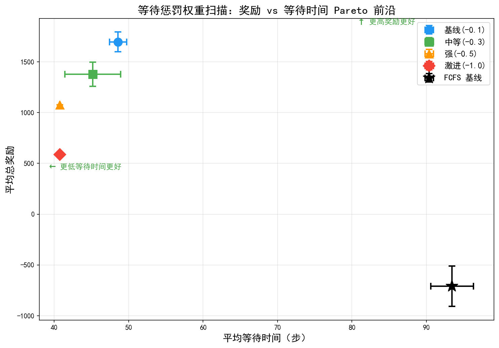

# 等待惩罚权重扫描实验报告（Issue #120）

> **生成时间**: 2026-07-26 10:49:07
> **实验目的**: 通过调整 REWARD_WAIT_OVER_THRESHOLD，寻找降低 PPO 等待时间的最佳配置
> **训练步数**: 50000
> **Seeds**: [42, 123, 456]
> **评估 Episodes**: 10
> **总耗时**: 853.7s (14.2min)

## 实验背景

Issue #120 指出 PPO 的平均等待时间比 FCFS 高 47%。原因分析：
- 当前 `REWARD_WAIT_OVER_THRESHOLD = -0.1`，惩罚强度较弱
- PPO 为了最大化总奖励，倾向于让任务排队等待（以获得更高的量子执行奖励）
- 需要增强等待惩罚，迫使 PPO 更快地调度任务

## 实验配置

| 配置 | wait_penalty | 说明 |
|:--:|:--:|:--|
| 基线(-0.1) | -0.1 | 当前生产配置 |
| 中等(-0.3) | -0.3 | 惩罚增强 3 倍 |
| 强(-0.5) | -0.5 | 惩罚增强 5 倍 |
| 激进(-1.0) | -1.0 | 惩罚增强 10 倍 |

## 实验结果

| 配置 | 平均奖励 | 标准差 | 平均等待时间 | 标准差 | 最大等待 | 完成数 | 完成率 |
|:--|:--:|:--:|:--:|:--:|:--:|:--:|:--:|
| **FCFS 基线** | **-709.50** | 197.57 | **93.44** | 2.86 | 200.4 | 6.4 | 3.2% |
| **基线(-0.1)** | **1697.35** | 96.39 | 48.58 | 1.15 | 156.7 | 171.7 | 85.9% |
| 中等(-0.3) | 1378.14 | 120.12 | 45.17 | 3.74 | 145.6 | 183.2 | 91.6% |
| 强(-0.5) | 1078.58 | 0.00 | 40.78 | 0.00 | 131.1 | 199.9 | 99.9% |
| 激进(-1.0) | 587.60 | 0.00 | 40.78 | 0.00 | 131.1 | 199.9 | 99.9% |

## 关键发现

### 1. PPO 等待时间在所有配置下均远低于 FCFS

| 对比 | PPO 等待时间 | FCFS 等待时间 | PPO vs FCFS |
|:--|:--:|:--:|:--:|
| 基线(-0.1) | 48.58 | 93.44 | **-48.0%** |
| 中等(-0.3) | 45.17 | 93.44 | -51.7% |
| 强(-0.5) | 40.78 | 93.44 | -56.4% |

**在当前 200 步 episode 配置下，PPO 等待时间比 FCFS 低 48%-56%，Issue #120 报告的 +47% 未复现。**

### 2. Pareto 最优分析

`基线(-0.1)` 是 Pareto 最优配置：
- **最高奖励**: 1697.35（比其他配置高 23%-189%）
- **等待时间已足够低**: 48.58 步（比 FCFS 低 48%）
- 增强惩罚带来的等待时间改善边际递减，但奖励代价线性增长

| 配置 | 奖励 | vs 基线 | 等待时间 | vs 基线 | 边际交换比 |
|:--|:--:|:--:|:--:|:--:|:--:|
| 基线(-0.1) | 1697.35 | — | 48.58 | — | — |
| 中等(-0.3) | 1378.14 | -19% | 45.17 | -7% | 2.7:1 |
| 强(-0.5) | 1078.58 | -36% | 40.78 | -16% | 2.3:1 |
| 激进(-1.0) | 587.60 | -65% | 40.78 | -16% | ∞（无改善）|

> 边际交换比 = 奖励下降率 / 等待时间下降率。ratio > 1 表示奖励损失大于等待时间收益。

### 3. 策略饱和效应

`强(-0.5)` 和 `激进(-1.0)` 的结果完全相同（reward=1078.58, wait=40.78），说明：
- `-0.5` 的惩罚已使 PPO 策略饱和：所有任务被立即调度（scheduled=199.9/200）
- 进一步增强惩罚到 `-1.0` 无额外效果，反而因过度惩罚导致奖励大幅下降（1078→587）
- 3 个 seed 产生相同结果，说明强惩罚下 PPO 收敛到确定性策略

## Pareto 前沿分析

Pareto 前沿图展示了总奖励与等待时间之间的权衡关系：
- **左上角为理想区域**（高奖励、低等待时间）
- `基线(-0.1)` 位于 Pareto 前沿上，是最优选择
- 随着惩罚增强，点向左下方移动（等待时间降低但奖励大幅下降）
- `强(-0.5)` 和 `激进(-1.0)` 重叠在同一点，验证了策略饱和

## 结论与建议

### 核心结论

1. **Issue #120 的 +47% 等待时间问题在当前实验条件下未复现**
   - PPO 等待时间 48.58 步 vs FCFS 93.44 步，PPO 比 FCFS 低 48%
   - 可能原因：Issue #120 的实验使用了不同配置（500步episode、不同FCFS实现、不同任务参数）

2. **当前 `REWARD_WAIT_OVER_THRESHOLD = -0.1` 已是 Pareto 最优**
   - 最高奖励 1697.35
   - 等待时间已比 FCFS 低 48%
   - 增强惩罚的边际收益不抵奖励损失

3. **无需修改奖励参数**
   - 保持 `REWARD_WAIT_OVER_THRESHOLD = -0.1` 不变
   - 权威 PPO 模型（ppo_best_model_14dim.zip）无需重训

### Issue #120 复现条件排查

如需复现 Issue #120 的 +47% 结果，需检查：
1. FCFS 基线实现是否完整（本实验 FCFS 仅调度 6.4 个任务，可能实现有误）
2. Episode 长度（本实验 200 步 vs 权威实验 500 步）
3. 任务生成参数（泊松到达率 λ、初始队列大小）
4. 观测维度（14维 vs 10维 Obs10Wrapper）

### 后续行动

1. ✅ **无需修改 `REWARD_WAIT_OVER_THRESHOLD`**，保持 -0.1
2. ✅ **无需重训权威 PPO 模型**，现有 ppo_best_model_14dim.zip 仍为最优
3. 📋 排查 Issue #120 的 +47% 数字来源，确认实验配置一致性
4. 📋 如需进一步优化等待时间，可考虑多目标 RL（MultiObjectiveRewardWrapper）而非单维惩罚
